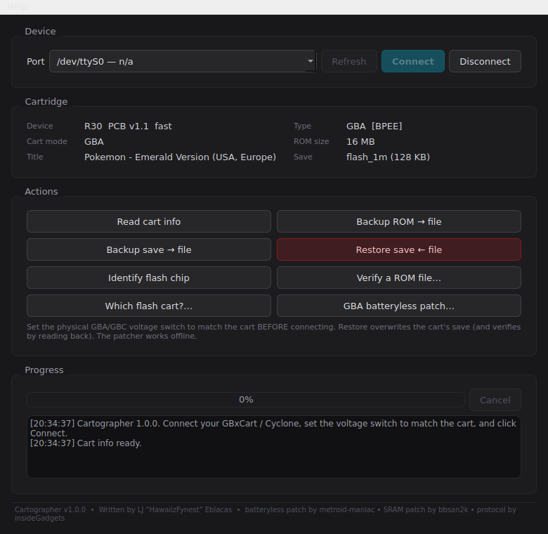

# Cartographer

[](https://github.com/HawaiizFynest/Cartographer/releases/latest)
[](https://github.com/HawaiizFynest/Cartographer/actions)
[](https://github.com/HawaiizFynest/Cartographer/releases)
[](LICENSE)
[](https://github.com/HawaiizFynest/Cartographer/releases/latest)
[](https://www.python.org/)

A desktop app for backing up, restoring and flashing Game Boy, Game Boy Color and
Game Boy Advance cartridges. It talks to a GBxCart RW (or a compatible clone like
the "Cyclone" board) over USB and gives you a point-and-click way to pull ROMs and
saves off a cart, put saves back, write a ROM to a flash cart, and check that
everything came out clean.

The software that ships with a lot of these flashers is a dead end, and there was
no single tool that also did batteryless save patching without dropping down to
three separate command-line programs. Cartographer rolls all of it into one app.

**Just want to use it?**
[Download the latest release](https://github.com/HawaiizFynest/Cartographer/releases/latest)
and run it. No install, no Python needed.



## What it does

### Reading

- Dumps GB, GBC and GBA ROMs, with the ROM size detected automatically on GBA.
- Backs up and restores saves for every save type: SRAM, EEPROM (4Kbit and
  64Kbit), Flash (512Kbit and 1Mbit with bank switching), and GB/GBC battery RAM.
  Game Boy saves read the correct amount per cart, so MBC2 (512 bytes), 2 KB and
  full 8 KB carts all come out right.
- Verifies a dump after it's pulled. It checks the Nintendo logo and header
  checksum, and on Game Boy the global checksum too, then computes CRC32 and
  SHA-1 and tells you whether the dump matches a known-good release. A single bad
  byte in the middle of a 16 MB ROM gets caught by the hash even when the header
  still looks fine.
- Writes a receipt next to each dump and restore. Dumps get a report with the
  checksums, header checks, save type and verdict; restores record the file's
  hashes and whether the read-back off the cart matched. A bare .sha1 file sits
  alongside for standard tools. Tools > Re-verify a ROM or save against its
  receipt rechecks the hashes later, so bit rot or a damaged copy shows up before
  you need the file. Turn it off in Settings if you'd rather not have the extra
  files.
- Restores saves back to a cart and reads them straight back to confirm the write
  landed. This is what makes a battery swap safe: back up the save, change the
  dead battery, restore, done.
- Names your dumps for you. The GBA header only stores a short 12-character
  title, so Cartographer looks up the full game name from the cart's game code,
  and upgrades to the exact release name from the SHA-1 once the whole ROM is
  dumped.
- Dumps a whole stack of carts in one sitting. Batch dump reads each cart's ROM
  and save, verifies it, names the file, and prompts you to swap in the next one.
- Keeps a library view of your dumps: what's verified good, and which files are
  duplicates of each other by hash.

### Writing to flash carts

- Writes a .gba ROM to a GBA flash cart, with every sector erased, written, then
  read back and checked against the file. The write stops at the first mismatch
  and says exactly where, so a bad write can't be reported as a good one.
- Picks the fastest write method the cart supports. It tests the firmware's
  buffered and block write commands on a single block first, including the
  data-line-swapped variants some repro carts need, and uses whichever verifies.
  If none of them do, it falls back to a slower word-at-a-time write that works
  anywhere. On a 4 MB game the difference is minutes instead of hours.
- Reports how long the write took.
- Identifies the flash chip before writing, and refuses to write without a
  confirmed chip and a sector map read from the chip itself.

### Flash chip identification

- Identifies the flash chip on a flash cart without writing anything to it, and
  reports the chip, its true size, its sector layout, and whether it's one the
  tooling knows how to write. Unknown chips get reported with their raw ID rather
  than a guess.
- Handles the 5V repro carts that stay silent at 3.3V. Some flash carts, including
  many EpicJoy and Gugxiom style boards, ignore every flash command at 3.3V. The
  probe raises to 5V for identification and drops back afterwards.
- Reads the chip's Common Flash Interface data for its real capacity and sector
  map, rather than guessing from the device ID. Several chips in the S29GL family
  share one ID across 16, 32 and 64 MB parts, so the ID alone can't tell them
  apart.
- Identifies the save flash chip too, which is a separate chip from the ROM flash.
  Games read that chip's ID before writing a save, and they also check its
  capacity, so a cart can hold a chip games know and still refuse to save a game
  that wants a different size. Reading that ID is the quickest way to find out
  what a cart actually provides, rather than trusting what the ROM asks for.
- Reading the save chip's ID is not free the way the ROM flash probe is. GBA
  carts have no separate bus for the save chip, so the ID request is a sequence
  of ordinary writes into the save address space. A flash chip reads those as
  commands and its contents are untouched. A cart with plain battery-backed RAM
  has nothing decoding them, and they land as data on a real save. Cartographer
  warns before running the check on anything that doesn't read as flash, and
  afterwards reports whether the command addresses changed, which tells you
  which of the two you have.

### Save tools

- Compares two save files and reports whether they match, how many bytes differ
  and where, and what that most likely means. Useful for checking whether a cart
  actually kept a save: back it up, power the cart down and back up, back it up
  again, and compare.
- Inspects a single save and tells you whether it holds real data or is blank.
- Edits a save byte by byte in a hex view with an ASCII column, with go-to-offset
  and a find box that takes text or hex. Edits are written to a new file, so the
  original is untouched. Alongside it sits a panel showing which regions hold data
  and which are blank, plus any readable text with its offset.
- Lets you override the detected save type, and remembers it between launches.
  Backup and restore normally use the type looked up from the game code, which is
  right for an unmodified game and wrong in two cases: a save-type patch changes
  where a game saves but leaves the game code alone, and a repro cart's game code
  describes whichever ROM is loaded rather than the board the save chip is on.

### Patching

- Patches a GBA ROM for batteryless saving, entirely offline, no device needed.
- Applies ROM hack patches. Point it at a clean base ROM and an IPS, BPS or UPS
  patch and it writes out the hacked ROM. BPS and UPS check the base ROM's
  checksum so you'll know if you've got the wrong version, instead of ending up
  with a broken game.
- Bakes Game Boy Game Genie codes into a ROM. Each code is checked against the
  ROM's existing byte and skipped if it doesn't match, so a wrong code can't
  corrupt the file. GameShark codes get decoded for reference (they're runtime
  RAM writes and can't be baked into a ROM).
- Tells you which flash cart a game needs. GBA flash carts are locked to one save
  type because the game checks the save chip's ID, so this saves you from buying
  the wrong one.

## The batteryless patcher

A lot of cheap flash carts have SRAM but no battery, so the save is gone the
moment you power off. The batteryless patch redirects the game's save into SRAM
and flushes it back to the ROM flash on write, so it survives without a battery.

That patch isn't original work here. Cartographer bundles a port of
**metroid-maniac's** `gba-auto-batteryless-patcher`, which does the real work, and
chains through **bbsan2k's** `Flash1M_Repro_SRAM_Patcher` first for the SRAM step.
The port was checked against both original tools to confirm it produces
byte-for-byte identical output before it shipped. Full credit to them, see the
Thanks section below.

## Getting started

The easy way is to grab a build. Head to the
[Releases page](https://github.com/HawaiizFynest/Cartographer/releases), download
the file for your system from the latest release, and run it. There's nothing to
install.

- Windows: `Cartographer-windows.exe`
- macOS: `Cartographer-macos.zip` (unzip it, then open Cartographer.app)
- Linux: `Cartographer-linux` (mark it executable with `chmod +x`, then run it)

Once you're in, set the voltage switch on your cart to match what you're reading
before you plug it in. GBA sits at 3.3V, GB and GBC at 5V. On the v1.1 board the
switch is physical and the software can't override it, so Cartographer warns you
if it looks like nothing's seated for the current switch position. Then pick your
COM port, hit Connect, and Read cart info. From there the buttons do what they
say.

Windows may throw a SmartScreen warning the first time, since the build isn't
code-signed. Click "More info" then "Run anyway."

### Writing a ROM to a flash cart

Writing erases whatever is on the cart, so it asks you to type ERASE to confirm.
Before that it identifies the chip and reads its sector map, and it won't write
without both. Once it starts, it tests which fast write command the cart supports
and uses it, then works sector by sector, checking each one against the file
before moving on.

A partial write is not damage. If you cancel, or a sector fails to verify, the
cart holds an incomplete ROM and can be written again.

### Running from source

If you'd rather run the Python directly (or you're working on the code), you'll
need Python 3.12 or newer:

```
pip install -r requirements.txt
python run.py
```

### Building it yourself

You don't have to. The GitHub Actions workflow builds Windows, macOS and Linux
binaries on every push, and grabs them from the Actions tab a few minutes later.
Tag a commit with the next version number and it publishes a Release with all
three binaries attached.

To build locally anyway:

```
pip install pyinstaller
pyinstaller --noconfirm Cartographer.spec
```

You'll get a single file in `dist/`.

## Checking for updates

Cartographer checks GitHub for a newer release when it starts, and you can check
any time from Help > Check for updates. When there's a new version it shows you
the full list of changes first, so you can decide whether it's worth it. From
a built binary it downloads and swaps itself, and the download is size-checked and
checked for a valid executable header before anything gets swapped. Running from
source instead? It'll point you at GitHub Desktop, since that's how you update
the code.

After an update, a What's New window shows what changed on first launch. You can
also open it any time from Help > What's new in this version, and there's a
checkbox to stop it appearing after future updates.

The text in those windows comes from `CHANGELOG.md`. Add a new `## vX.Y.Z`
section to that file before tagging a release, and the release notes and the
in-app What's New window both pick it up automatically.

## What's not done yet

- Save-type patching. Writing a ROM works, but a game whose save type doesn't
  match the cart won't save. Patching a ROM to save somewhere else needs a
  compiled payload injected into the ROM, which is a different kind of job from
  everything else here. For now that step is handled by external tools.
  Identifying the save chip at least tells you what the cart provides, so you
  know which type to patch towards instead of guessing.
- The game database only has a few dozen titles seeded in it right now. Every
  dump you make gets remembered by hash, so exact names build up over time, but a
  full No-Intro import is on the list.
- Atmel-type flash saves. The common flash save path is done; the handful of
  older Atmel carts would need their own write routine.
- Writing to GB and GBC flash carts. The GBA write path is done; the Game Boy
  side would need its own routine and a cart to test against.

## Thanks

This wouldn't exist without a lot of other people's work:

- **metroid-maniac** for the GBA auto batteryless patcher. That's the core
  feature and it's their code, ported into Python here.
- **bbsan2k** for the Flash1M repro SRAM patcher that handles the SRAM step.
- **insideGadgets** for the GBxCart RW hardware and the serial protocol this
  whole app is built to speak.
- **Lesserkuma** and the FlashGBX project, the reference for how title and
  save-type resolution should work, and for how the flash write path is driven.

The original licenses for the patchers live in the `licenses/` folder.

## License

GPL-2.0. Written by LJ "HawaiizFynest" Eblacas.

The bundled patcher ports keep their original MIT licenses (see `licenses/`).
insideGadgets' GBxCart protocol is documented under CC BY-NC-SA, so this is fine
for personal and open-source use. Cartographer is an independent client and
includes none of their code.
